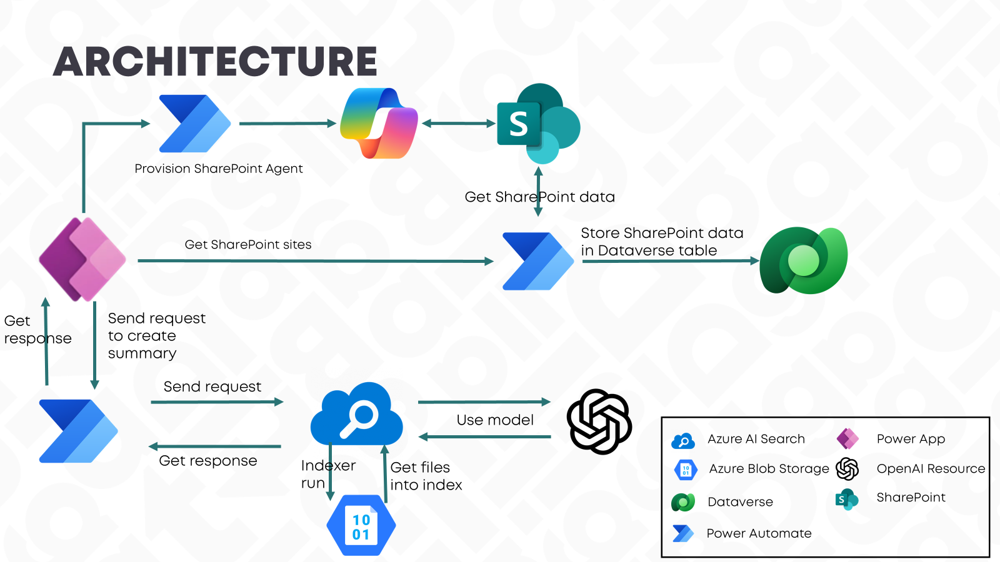
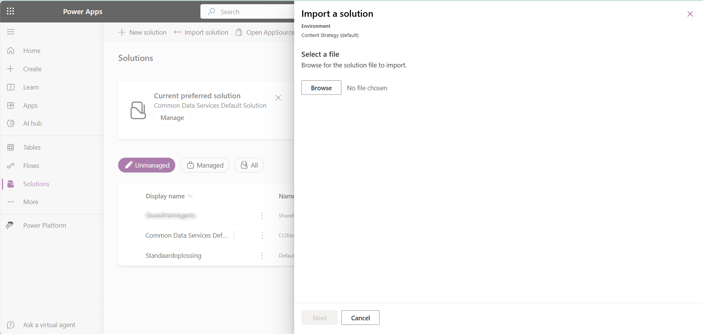
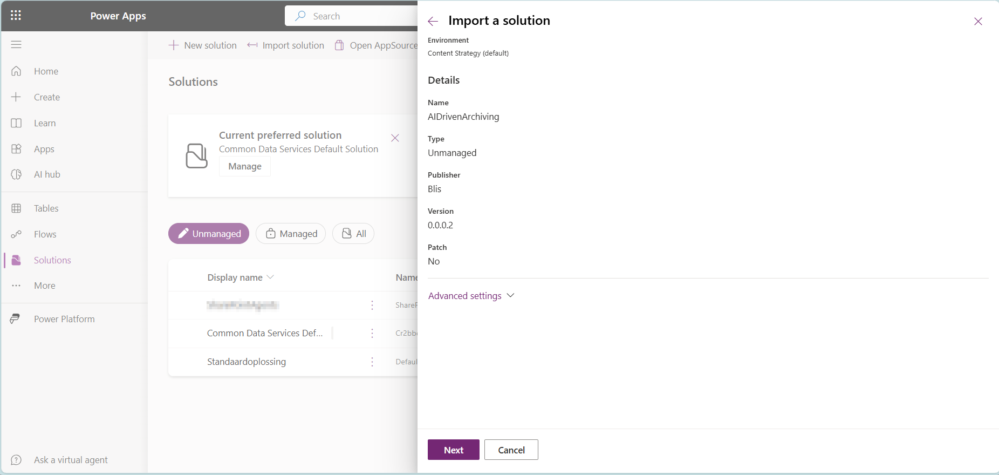
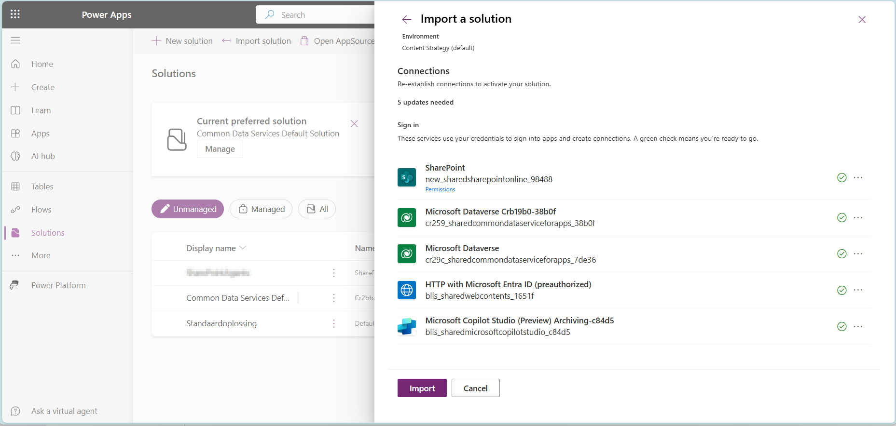
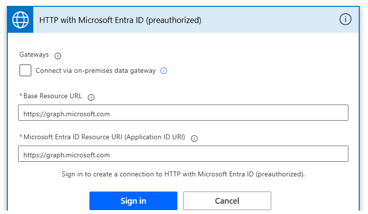

# Setup AI Driven Archiving of SharePoint Sites

## Description
This project addresses the challenges faced by SharePoint administrators and archivists in managing the complete lifecycle of SharePoint sites. In many organizations, SharePoint sites often exist without clear ownership, leaving archivists to evaluate whether they should be archived and under what retention policies. This process can be time-consuming, particularly when managing a large number of sites.

The goal of this project is to streamline the archiving process and provide support to archivists, making SharePoint site management more efficient and mature. A Power App has been developed to offer a comprehensive overview of SharePoint sites, providing key data such as last modification dates and usage statistics.

The solution incorporates AI-powered assessments to generate summaries of the sites and detect sentiment, helping archivists make informed decisions about archiving. Additionally, a SharePoint agent is provisioned on demand, enabling users to engage in conversations about the site. This tool also allows archivists to confidently set archiving statuses or seek a second opinion from colleagues.
Overall, the project simplifies and accelerates the archiving process, ensuring proper lifecycle management of SharePoint sites with the help of AI technology.

## Team members

|Name|| 
|---|---|
|Elianne Burgers | [GitHub](https://github.com/Dutchy365) |
|Ruben Baars| [GitHub](https://github.com/RubenB078)|
|Richard Wierenga| [GitHub](https://github.com/richardwie) |

## Architecture
The architecture which supports this process:

## Scope
The scope for this setup description is the setup of the Power Platform related artifacts. If you are interested in the other details, please reach out.
For the use case of the Powerful Hackathon 2025 all Power Platform related artifacts are available in one solution.
An unmanaged version of this solution can be [downloaded here]().

## Prerequisites
User need a Copilot license and Power Apps Premium

## Import Solution
Go to the solutions part of the environment on which you want to import the solutions.
Click on import solution and select the zip file.

Click on next and you'll see some details of the solution

Click on next and create the needed connections.

For the connector 'HTTP with Microsoft Entra ID (preauthorized)' you need to enter the details for the Base Resource URL and Resource URI.
For both of them it is: `https://graph.microsoft.com`

## First time
Opening the app for the first time it starts with an empty overview.
Click on 'Update list' button to retrieve data from the SharePoint sites.
Please be aware the user you are doing this with needs to have access to the sites to get a site in the overview.

